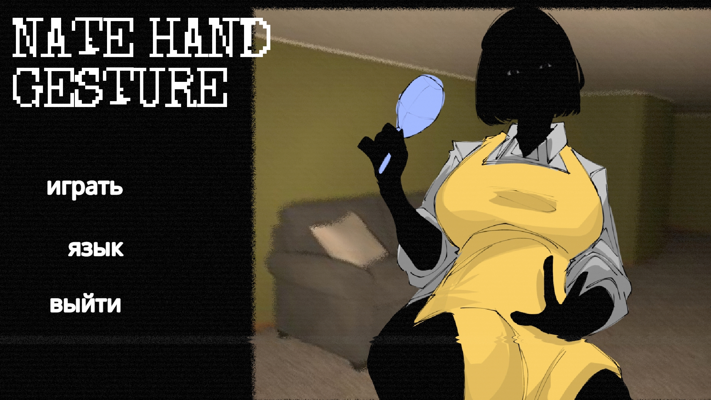

# Русификатор Nate Hand Gesture Demo

Инструкция по установке

1. Перед запуском `.bat` файла поставь в игре язык **«eng»** (English) — пункт меню «language» в главном меню игры.

   

2. Запусти `install_rus.bat`.
3. Введи букву диска, на котором установлена игра (например `C`).
4. Играй!

> Если во время установки пишет «Не найдена папка Data» — проверь букву диска и убедись, что игра установлена через Steam в папку `SteamLibrary\steamapps\common\Nate Hand Gesture Demo`.
